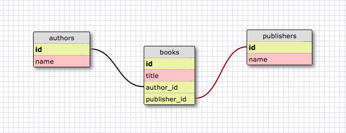

# Part 4: SQL Queries
## Summary
In this part of the assessment you will be working with the provided SQL database
`bookshelf.sqlite` to demonstrate your ability to construct queries. The schema
(image below) is made up of three tables, `books`, `authors`, and `publishers`.



To get started open a SQLITE session in the console with the following command (note: assuming in the part-4 directory)

```bash
$ sqlite3 bookshelf.sqlite
```
## Releases
### Release 0: `SELECT`
In your terminal, create and execute the following queries:
- show all the books
- show all the publishers
- show all the authors

Copy the terminal output and paste the results into the `part-4/queries.md` file.

### Release 1: `WHERE`
In your terminal, create and execute the following queries:
- show all the books containing "Ruby" in the title
- show the authors with a name starting with "Dav"

Copy the terminal output and paste the results into the `part-4/queries.md` file.

### Release 2: `JOIN`
In your terminal, create and execute the following queries:
- show all the books published by "Addison-Wesley"
- show all the books authored by "Jonathan Penn"
- show all the publishers where the book title contains "iOS"
- show all the publishers for the author "Sandi Metz"

Copy the terminal output and paste the results into the `part-4/queries.md` file.

### Release 3: `INSERT`
In your terminal, create and execute the following queries:
- add a new author to the authors table
- add a new publisher to the publishers table
- add a new book to the books table with the new author and publisher

Copy the terminal output and paste the results into the `part-4/queries.md` file.

### Release 4: `UPDATE`
In your terminal, create and execute the following queries:
- update the author named "David Black" to "David A. Black"

Copy the terminal output and paste the results into the `part-4/queries.md` file.

### Release 5: `DELETE`
In your terminal, create and execute the following queries:
- Delete the book created in Release 3
- Delete the author created in Release 3
- Delete the publisher created in Release 3

Copy the terminal output and paste the results into the `part-4/queries.md` file.

## Conclusion
You are done with part-4. If you have not committed your changes, please do so before moving onto part-5.
